# Divoom Pixoo 64 – animated Home Assistant dashboard

Animated, themeable dashboard and weather pages for the **Divoom Pixoo 64**, rendered by Home Assistant
and shown through the [divoom_pixoo integration](https://github.com/gickowtf/pixoo-homeassistant).

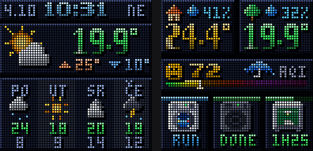

**More designs:** each has its own fonts and layout.

| | | |
|---|---|---|
| **comic**: halftone panels with slanted gutters, speech bubbles, action bursts, captions | **mech**: steel bulkhead, amber CRT screens with scanlines, analog air-quality needle, annunciator lamps | **platformer**: original 8-bit world; air quality as health hearts, wooden signs, a fox hero (teal scarf, lantern at night, hood up when rain is coming, happy spin when the laundry is done), gems, forecast on floating islands |
| 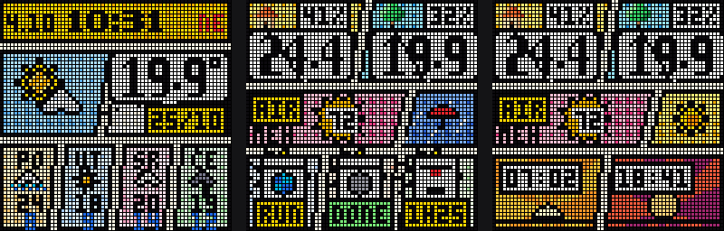 | 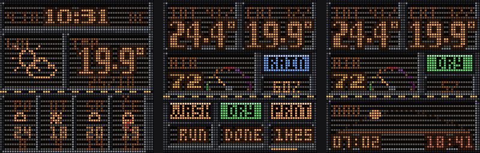 | 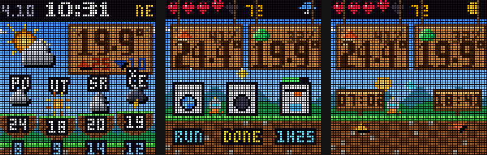 |


| | | |
|---|---|---|
| **digital_rain**: falling glyph code; terminal readouts; the rain gets heavier when it actually rains | **block_3d**: perspective room with moving floor grid; extruded 3D numbers; isometric appliances; shaded spheres; forecast as 3D bars | **hud**: holographic interface; 270° ring gauges with 7-segment digits; radar sweep; sun travelling its real day-arc; forecast as a glowing line chart |
| 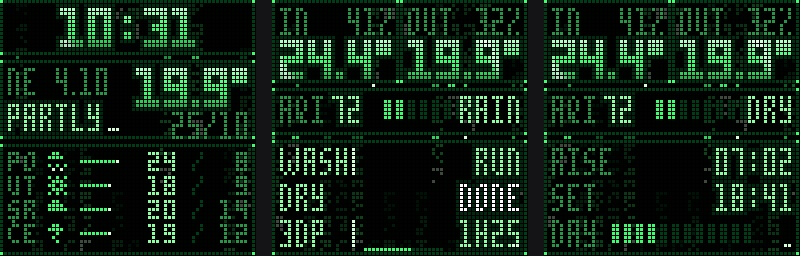 | 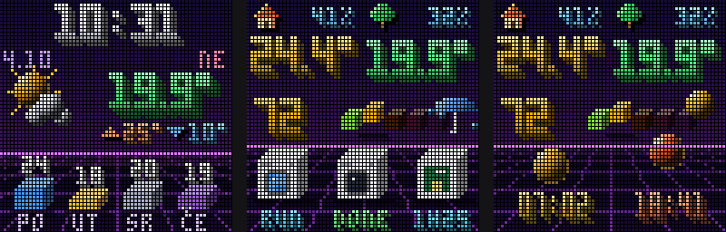 | 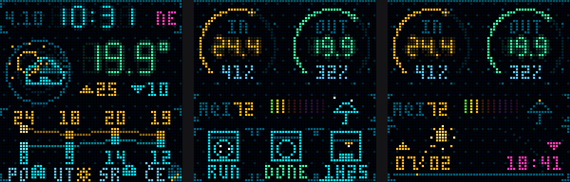 |

**Art designs:** four complete redesigns in the style of famous artists. These are original pixel art, not copies of specific paintings.

| | |
|---|---|
| **Mondrian**: black grid, white and primary-colour cells that change with your data, colour squares running along the lines | **Van Gogh**: animated swirling brushstroke sky, star-like orbs, wind-swept golden wheat field |
| 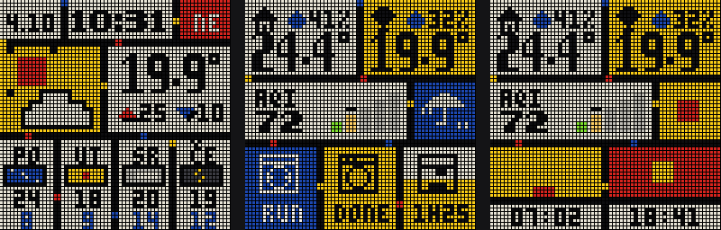 | 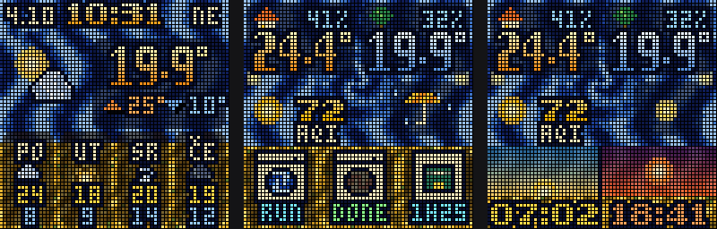 |
| **Hokusai**: woodblock paper, gradient skies, title cartouches, red seal stamp, paper umbrella, rolling waves | **Klimt**: shimmering gold-leaf mosaic with spirals and gem tiles, black panels, gold-leaf numbers |
| 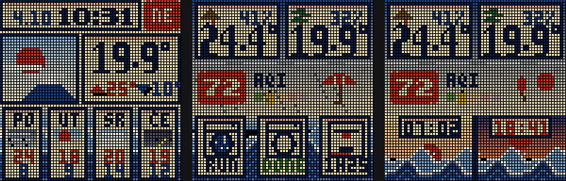 | 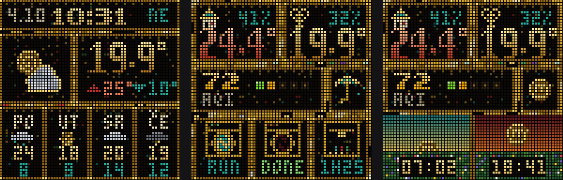 |

**Purist and kid designs:** two opposites.

| | |
|---|---|
| **purist**: clean and clear for people who just want the numbers. Every value has a label and a unit, statuses are words (RUNNING, DONE, IDLE FOR 2H), dates and conditions are spelled out, and the fonts were drawn for legibility (square 0 vs round O, S vs 5, Z vs 2, B vs 8, open-top 4). Colour only where it carries meaning (air quality, rain, appliance state). | **kid**: drawn by a five-year-old with crayons on white paper. A house and a tree for indoor/outdoor, a crayon face for air quality, a purple umbrella (or a sun in sunglasses), smiling suns, wobbly hand-written numbers, scribbled colouring that goes over the lines, and machines with gold-star stickers when they're done. On a dark background it switches to chalk. |
| 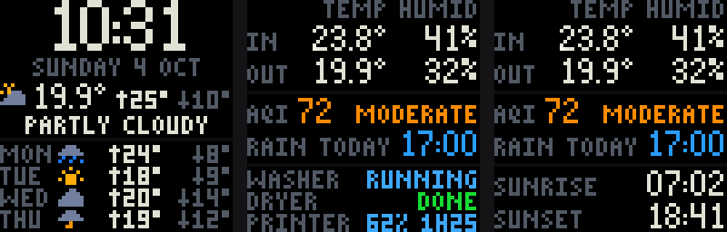 | 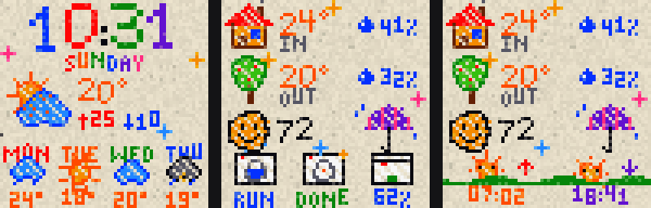 |
| *purist, Hrvatski labels, white paper* | *kid, Hrvatski labels, chalkboard, at night* |
| 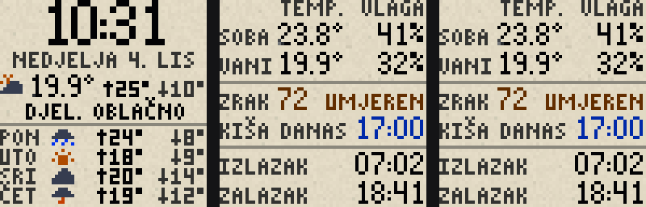 | 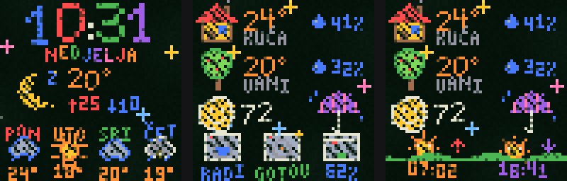 |

## Features

- **Two animated pages**: a home dashboard and a weather page with a 4-day forecast.
- **Dashboard:** indoor and outdoor temperature and humidity, an air-quality face with a continuous colour gauge (lit up to the current value with a travelling shine, the rest of the scale dimmed and dotted), and live status for the washing machine, dryer and Bambu Lab P1S printer.
  - The washer drum tumbles, the dryer swirls, and the printer toolhead moves while printing.
  - Print progress shows in the tile's top strip.
- **Smart bottom row:** when the washer, dryer and printer are all idle or off, the bottom row shows an animated sunrise/sunset scene: the sun rises over shimmering water at dawn and sinks into a red sky at dusk. As soon as one of them becomes active, the page alternates between the appliances and the sunrise/sunset scene. Appliances that are still idle show how long ago they were last used (🕒 2H / 2D).
- **Umbrella forecast:** using the hourly forecast for the rest of today, the dashboard shows an open umbrella with dripping rain if rain is expected later today, or a closed umbrella with a sun if it isn't. "Expected" means an hour with ≥ 40% chance, ≥ 0.2 mm, or a rainy condition. Tune this with `RAIN_PROB` / `RAIN_MM` in the script.

  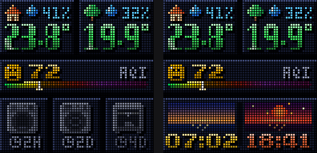
- **Weather page:** Croatian day names (PO, UT, SR, ČE, PE, SU, NE). Every icon moves, at both sizes: clouds drift, the sun's rays turn, the moon bobs and glows, and rain, snow, lightning, fog and wind animate. Plus the current temperature in 3D gradient digits, today's high/low and a 4-day forecast.
- **Themes for every design:** `neon`, `steel`, `synthwave`, `crimson_desert`, `christmas`, `halloween`, `retro_platformer`, or the design's `original` look. `seasonal (auto)` switches to Halloween from Oct 24–31 and to Christmas from Dec 1 to Jan 6. Design and theme can each rotate hourly, every 6 hours or daily.
- **Motion controls for every design:** choose how much moves and how fast, and separately how often and how fast effects happen, from a completely still image to everything moving. See [Motion](#motion).
- **Backgrounds:** 23 backgrounds (solid colours, papers, chalkboard, wood, brick, carbon, denim, starfield, skies, patterns) for the designs that don't paint their own scenery. See [Backgrounds](#backgrounds).
- **Label language:** the purist and kid designs can be labelled in English or Hrvatski.
- **Colour boost for low brightness:** gamma and saturation correction so colours stay vivid instead of washing out on a dimmed panel.
- **Repaired pixel font:** the integration's `pico_8` table has ~36 glyphs cut to 4 rows (O, F, S, P, T…). The renderer ships fixed versions.

| | |
|---|---|
| 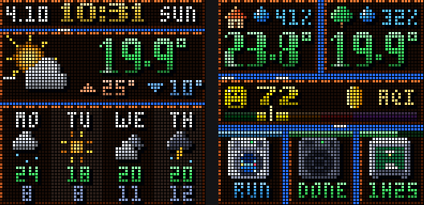 | 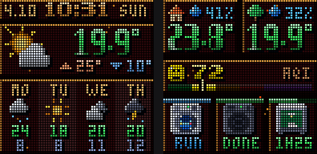 |
| 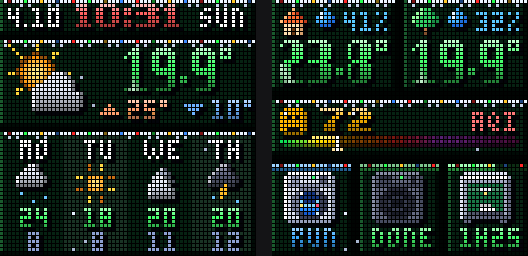 | 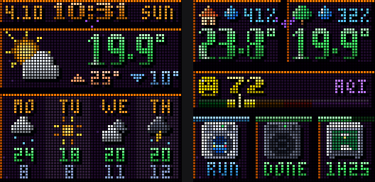 |
| 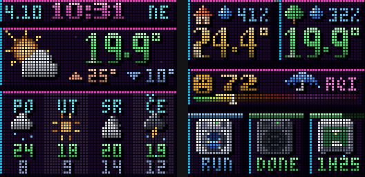 | 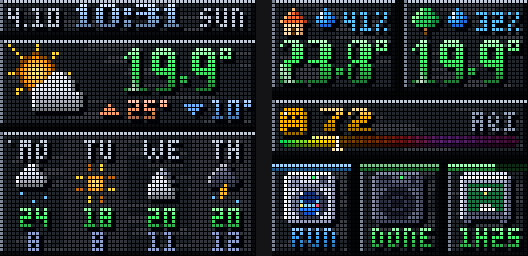 |

## How it works

A Home Assistant automation collects sensor states and the weather forecast. Every minute, and on every change, it passes them to `pixoo_render.py` through `shell_command`.

The script draws GIFs (16–32 frames, or a single frame when everything is set to still) into `/config/www/pixoo/`, which HA serves at `/local/pixoo/`. The integration's `gif` pages then tell the Pixoo to download and loop them on the device, so animation is smooth and nothing streams per frame.

The script needs only Pillow, which already ships with Home Assistant. One run (all pages) takes about 0.5–2 s on a desktop at default motion settings; the slowest motion speeds use longer loops and take up to about twice as long.

## Installation

1. **Copy the files:**
   - `pixoo/pixoo_render.py` → `/config/pixoo/pixoo_render.py`
   - `homeassistant/packages/pixoo_animated.yaml` → `/config/packages/pixoo_animated.yaml`
2. **Enable packages** in `configuration.yaml`, if you haven't already:
   ```yaml
   homeassistant:
     packages: !include_dir_named packages
   ```
3. **Set your entity IDs** in `pixoo_animated.yaml`. They appear in the trigger list and in the `payload` template.
4. **Restart Home Assistant.** Then open `http://<HA-IP>:8123/local/pixoo/weather.gif` in a browser to check the output.
5. **Configure the Pixoo pages.** Paste `homeassistant/pixoo_pages.yaml` into *Settings → Devices & services → Divoom Pixoo 64 → Configure → List of pages in YAML* and replace `192.168.50.X` with your HA IP.

## Settings

| Helper | What it controls |
|---|---|
| `input_select.pixoo_design` | **What it looks like**: layout and art style. `classic`, `mondrian`, `van_gogh`, `hokusai`, `klimt`, `digital_rain`, `block_3d`, `hud`, `comic`, `mech`, `platformer`, `purist`, `kid`, `rotate`, `rotate (no classic)`. |
| `input_select.pixoo_theme` | **How it's coloured**, for every design. `original` (the design's own colours), `seasonal (auto)`, `neon`, `steel`, `synthwave`, `crimson_desert`, `christmas`, `halloween`, `retro_platformer`, `rotate`. |
| `input_select.pixoo_rotation` | **How often** design and/or theme change when set to `rotate`: `daily`, `every 6 hours`, `hourly`. |
| `input_select.pixoo_colors` | **Panel calibration**, not a style: `vivid` (default), `extra vivid`, `soft`, `off`. |
| `input_select.pixoo_background` | **Background** for classic, hud, digital_rain, block_3d, mech, purist and kid. `design default` keeps the design's own. |
| `input_select.pixoo_language` | Labels of the purist and kid designs: `english`, `hrvatski`. |
| `input_number.pixoo_motion_level` | **Moving parts**, 0–5: how much moves (default 5). |
| `input_number.pixoo_motion_speed` | **Moving parts speed**, 0–5 (default 3 = original speed). |
| `input_number.pixoo_effects_frequency` | **Effects frequency**, 0–5: how often effects happen (default 3). |
| `input_number.pixoo_effects_speed` | **Effects speed**, 0–5 (default 3). |

The defaults reproduce the original look and pace.

### Motion

Everything that moves is either a **moving part** or an **effect**.

**Moving parts** are things that live in the picture. The level decides which of them move; the rest freeze in a natural pose (forecast bars fully grown, signs hanging straight, the fox standing):

| Level | What moves |
|---|---|
| 0 | Nothing: a single still image (also the lightest load for the Pixoo). |
| 1 | Only indicators that carry meaning: running or finished machines, blinking errors, the current weather icon, the rain umbrella. |
| 2 | + small life: forecast icons, sun cards, gauges, needles, rings, hearts, the kid's blinking air-quality face. |
| 3 | + scenery: skies, waves, clouds, wheat, mosaics, the 3D room grid, falling code, chimney smoke. |
| 4 | + characters and decor: the platformer fox and swinging signs, Mondrian's running squares, comic bursts, hazard stripes, the kid's bird. |
| 5 | Everything, including the kid design's hand-drawn "line boil". |

Speed 0 is a slow 4-second cycle, 3 the original 2 seconds, 5 a quick 1 second.

**Effects** are highlights on top: glint sweeps over numbers, Klimt's gold shimmer, HUD glitches and scan lines, the CRT rolling band, sparkles and glitter, and theme particles (snow, embers, bats, stars). Frequency 0 turns them off; 1 shows them in about one minute out of four, 2 every other minute, 3 once per loop (original), 4 and 5 several times per loop. Continuous effects such as scan lines and theme snow run whenever frequency is 1 or more and get denser as it rises. Effects speed 0 makes each sweep slow and long, 5 a quick flash.

Values are never animated into wrong digits at any setting.

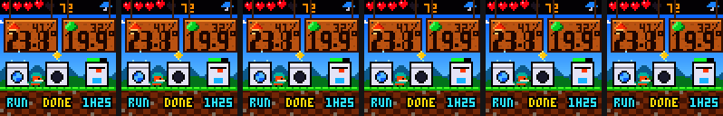

*Moving-parts level 0 → 5 (left to right), effects off.*

### Backgrounds

`black`, `midnight`, `charcoal`, `forest`, `burgundy`, `ocean`, `white paper`, `kraft paper`, `notebook`, `graph paper`, `blueprint`, `chalkboard`, `wood`, `brick`, `carbon`, `denim`, `linen`, `terrazzo`, `starfield`, `day sky`, `sunset`, `polka dots`, `stripes`.

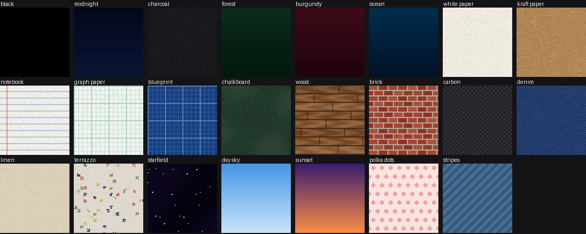

- **classic, hud, digital_rain, block_3d, mech:** bright backgrounds are dimmed automatically so the light text stays readable (on classic the background shows through the tiles, on block_3d it becomes the back wall).
- **purist:** the pattern is softened, and the ink switches between dark-on-light and light-on-dark to suit the background. Default: `black`.
- **kid:** used as is; on dark backgrounds the crayons turn into chalk. Default: `white paper`.
- **mondrian, van_gogh, hokusai, klimt, comic, platformer** keep their own scenery, because there the backdrop *is* the artwork (and the platformer sky shows the time of day and weather).

Themes still apply on top of a background.

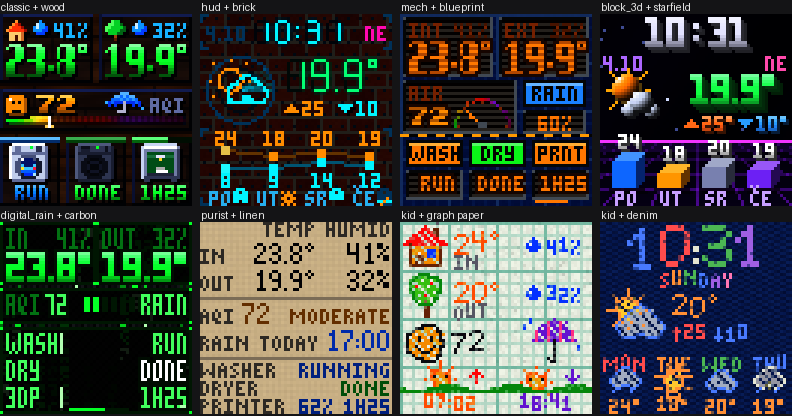

On the classic design, themes are hand-tuned palettes. On every other design, a theme recolours the background, frames and artwork towards its palette and adds its decorations (snow, string lights, bats, embers…). Text, numbers and colour-coded indicators (AQI colours, status lamps, health hearts) are never recoloured, so their meaning stays intact.

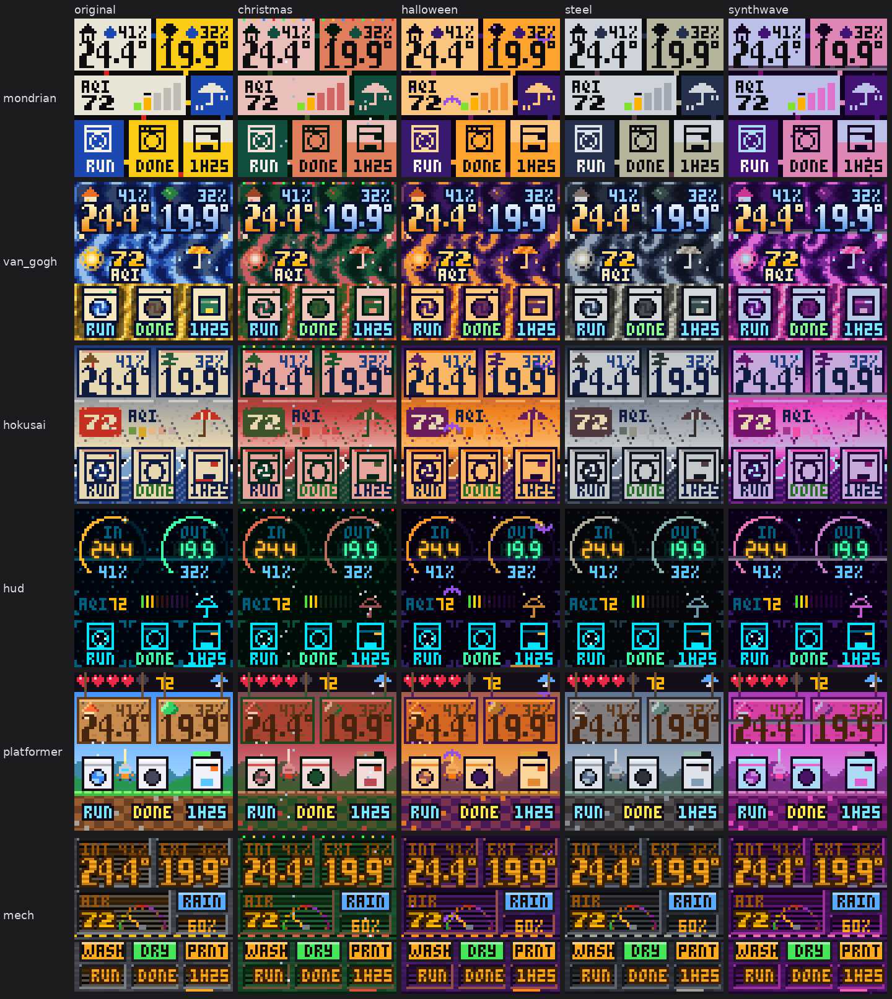

Constants at the top of `pixoo_render.py`: `FRAME_MS` (GIF frame time), `NIGHT_DIM` (global dimming), and `RAIN_PROB` / `RAIN_MM` (umbrella threshold).

### Expected data

| Key | Source |
|---|---|
| `wm`, `td` | Washer and dryer state machines (Appliance Notifications blueprint states: `idle`, `job_ongoing`, `job_completed`, `paused`, `detached_overload`, `unplugged`) |
| `pr`, `pr_left`, `pr_pct` | Bambu Lab integration: print status, remaining minutes, progress % |
| `*_age` | Seconds since the entity's `last_changed`. This resets when HA restarts. |
| `forecast` | `weather.get_forecasts` (daily) |
| `hourly`, `hourly_ok` | `weather.get_forecasts` (hourly), only the remaining hours of today |

## Troubleshooting

- **Only one page shows, or the time on the weather page is frozen:** open `http://<HA-IP>:8123/local/pixoo/status.txt`.
  - If it's missing or old, the renderer isn't running. Check that `input_select.pixoo_theme` exists under *Developer tools → States*. If it doesn't, the package didn't load: make sure `packages:` is enabled, and look for "package" errors in the log.
  - If it lists `ERRORS`, the traceback shows what failed. Please open an issue with it.

- **Page stays black:** check the GIF URL in a browser from another device. The Pixoo needs plain `http` on your LAN. If it still doesn't work, try removing the `?v=` cache-buster.
- **Colours look too dark or too bright:** switch `Pixoo colour boost` to `soft` or `extra vivid`.
- **Nothing updates:** look in *Settings → System → Logs* for `pixoo_render` warnings.

**Project notes** (full context for contributors): [docs/PROJECT_NOTES.md](docs/PROJECT_NOTES.md)

## Legacy

`legacy/` contains the earlier static `components` page versions (flat and 3D). They don't need a script, but they also can't animate or use themes.

## Credits & license

MIT licensed. Bitmap font tables are adapted from [gickowtf/pixoo-homeassistant](https://github.com/gickowtf/pixoo-homeassistant) (MIT). All artwork is original pixel art drawn in code. The themes are original designs and aren't affiliated with any game or brand.
